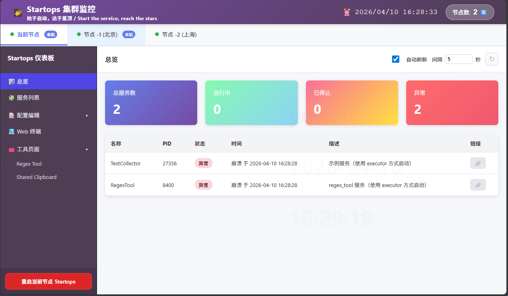
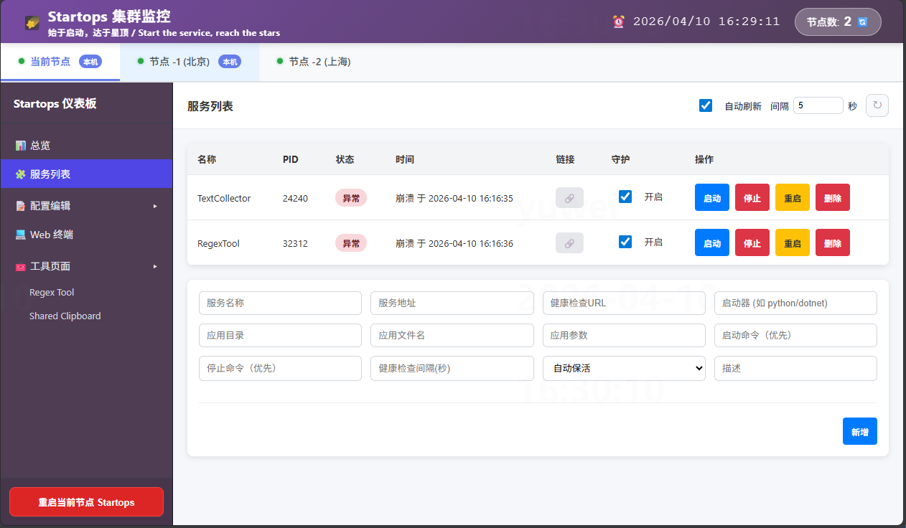
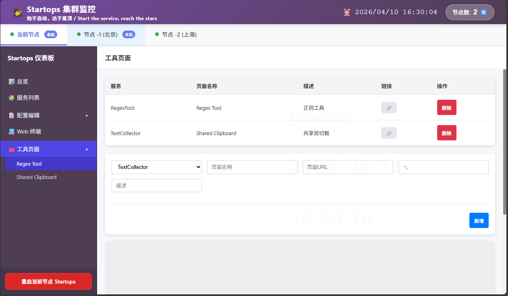
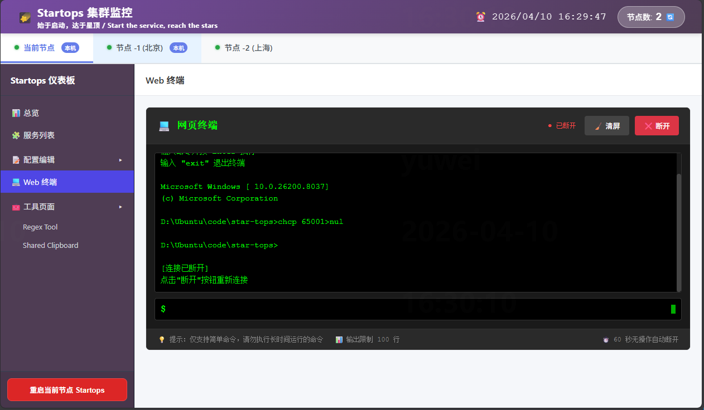

# StarTops

StarTops is a lightweight operations console for small and medium internal services.

It provides:

- Service monitoring and start/stop/restart
- Visual config file editing
- Unified tool page portal
- Web terminal (Windows/Linux)

## Features

- Dashboard overview (status, PID, timestamps)
- Service registration/unregistration and guard switch
- Config registration and web-based editing
- Tool page registration and unified access
- Controlled self-restart with `restart_by_self=true/false`

## Requirements

- Python 3.8+
- Windows or Linux

## Quick Start

1. Install dependencies

```bash
pip install -r requirements.txt
```

2. Run

```bash
python main.py
```

or override listen address/port:

```bash
python main.py -l 0.0.0.0 -p 8765
```

3. Open

- Home: `/`
- Dashboard: `/dashboard`

## Key Config

Main config file: `configs/startops.json`

- `server.host`, `server.port`, `server.debug`
- `server.restart_by_self`
	- `true`: spawn a new process via deployment script, then exit
	- `false`: graceful shutdown only, rely on external supervisor (systemd/NSSM)
- `terminal.shell` (on Windows, `cmd.exe` is recommended)

## Project Layout

```text
main.py                # FastAPI entrypoint
src/                   # core source code
configs/               # runtime configs
deployment/            # startup/service/restart scripts
docs/                  # design documents
test/                  # tests
```

## Screenshots

### Main Page



### Service List



### Tool Page



### Web Terminal



## Notes

- See `docs/DESIGN.md` for full design details.
- If `pytest` is not installed, test execution will fail until installed.
